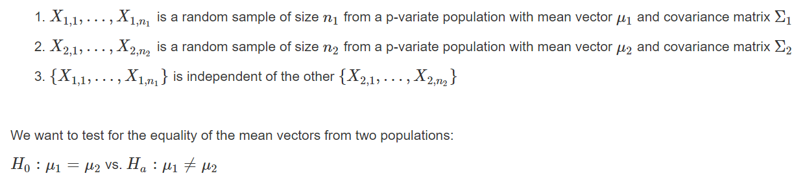

# Power Study to Compare Mean Vectors from Two-Populations

We considere two populations with the assumptions:

We compare mean vectors from two populations when:

* (4) Both populations are not multivariate normal distributed
* (5) when the covariance matrices are different.

We construct a power study that estimates the power and type-I error of the approximate test when the assumptions are not met.

The visualization files uses shiny apps to show the power for different mean vectors, distributions and covariance matrices.
